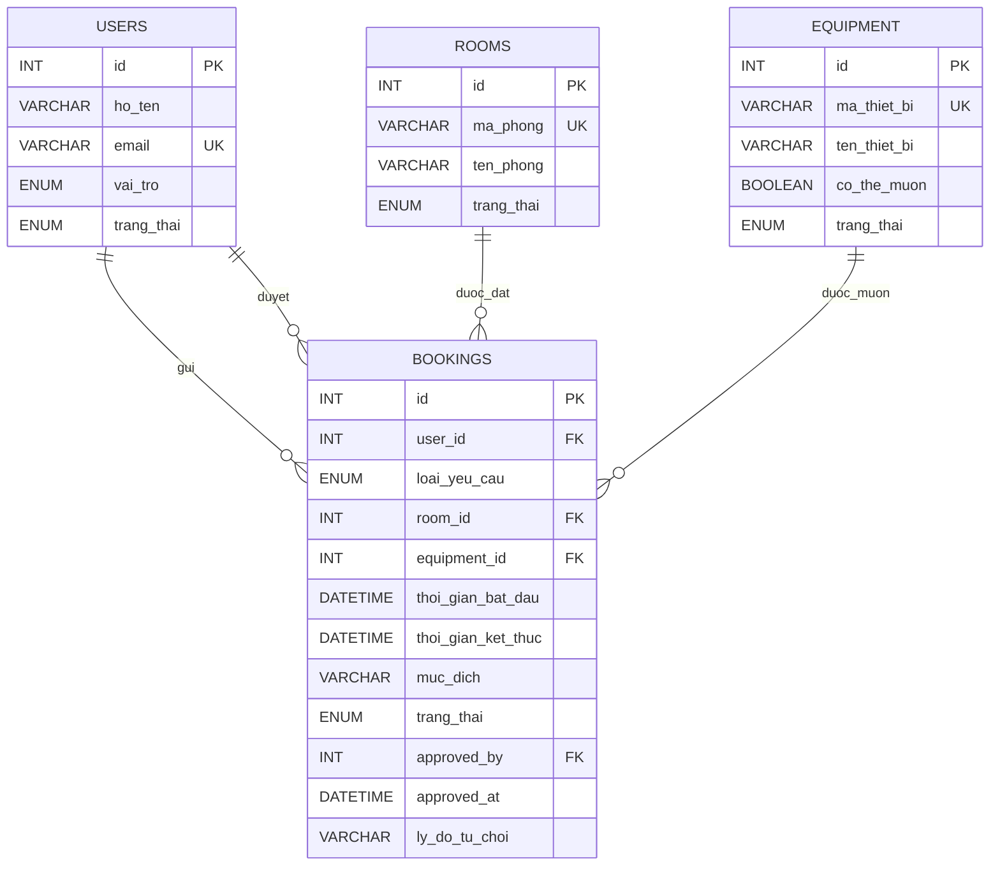

# ERD cá nhân - Nguyễn Kỳ

Chức năng phụ trách: duyệt yêu cầu và quản lý booking.

Một người dùng có thể gửi nhiều yêu cầu. Mỗi yêu cầu chỉ đặt một phòng hoặc mượn một thiết bị. Người duyệt được lưu bằng `approved_by`, tham chiếu đến bảng `users`.

Không lưu tên người gửi, tên người duyệt hoặc tên tài nguyên trong `bookings` vì có thể lấy bằng khóa ngoại. Không lưu số thứ tự vì đã có `id`.
